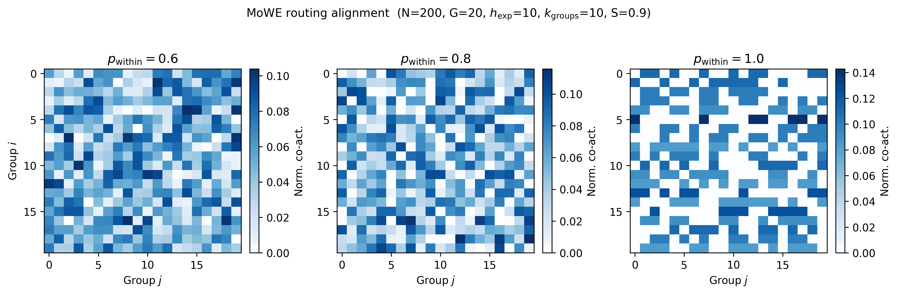
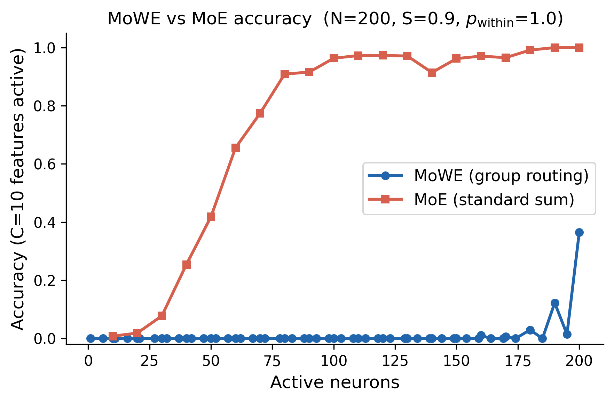
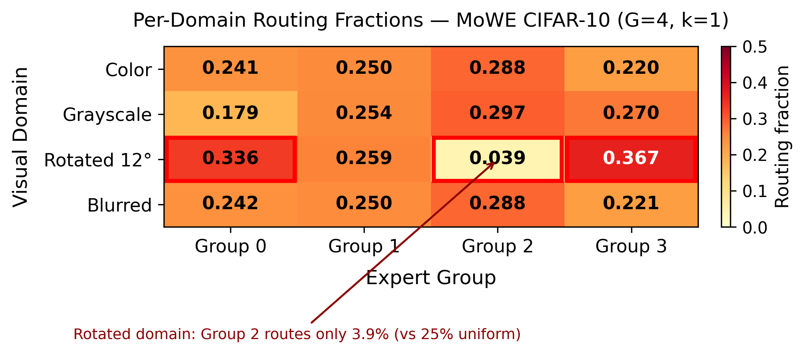
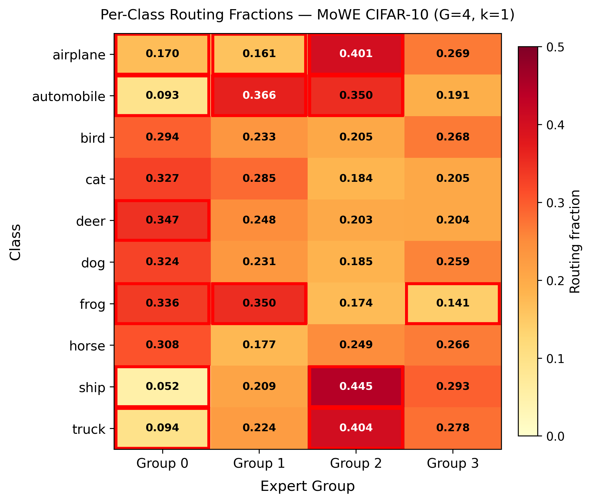
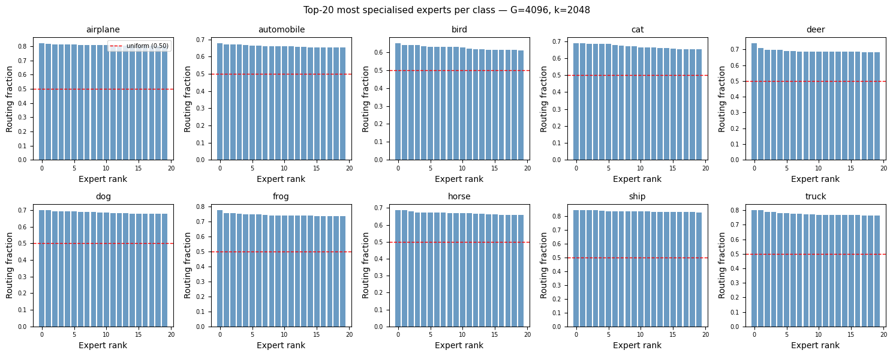
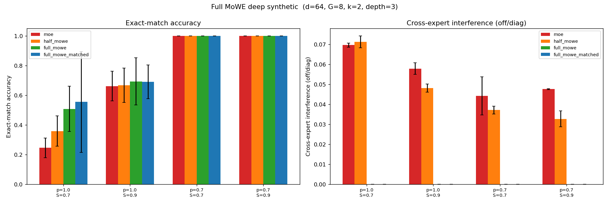
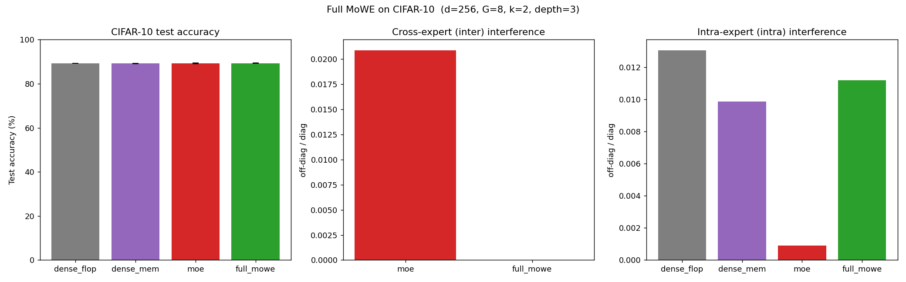
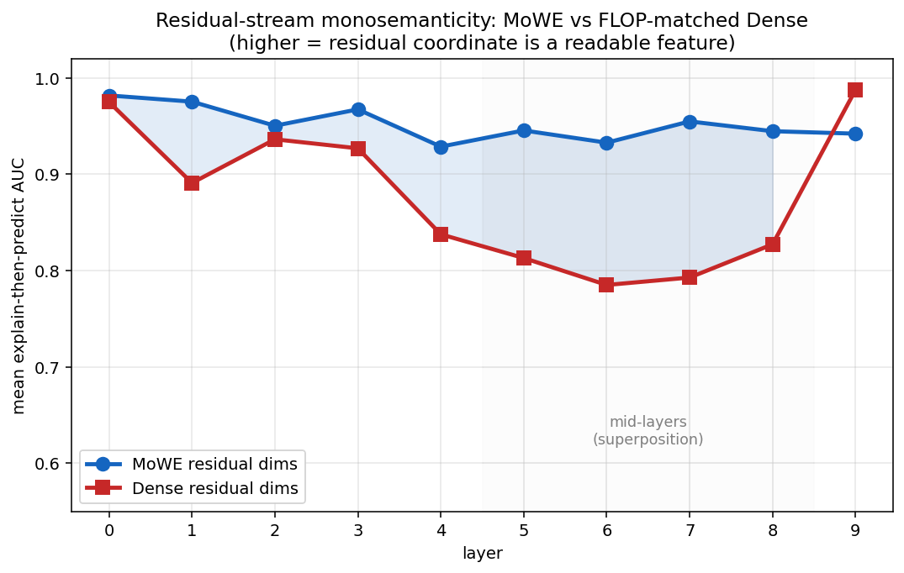
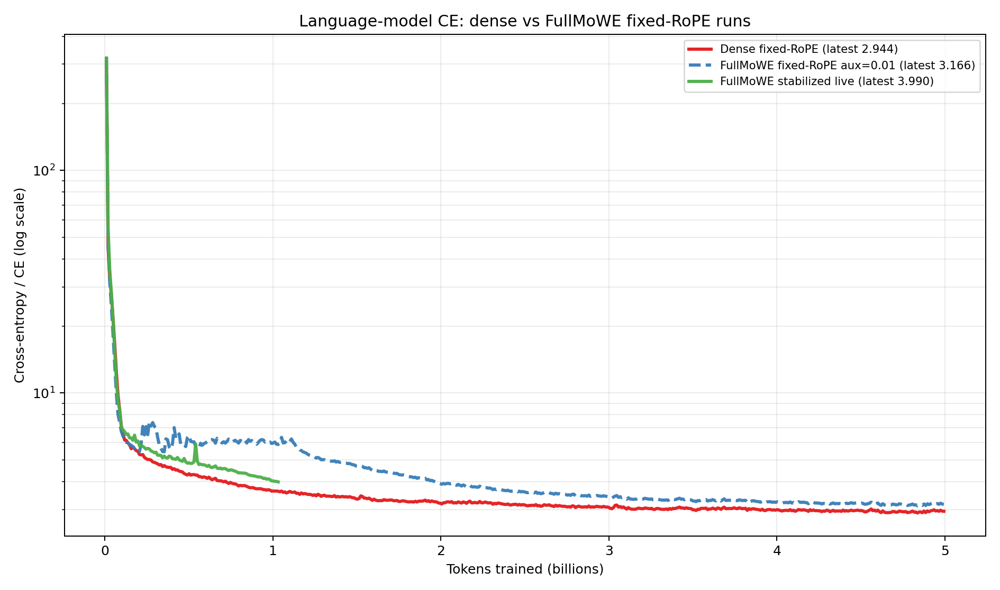
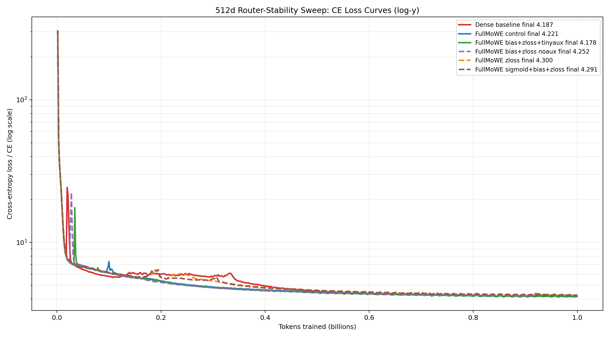

# Mixture of Wide Experts: sparse neural computation without expert interference

_Progress draft for website. This is not a final paper draft; it is a transparent snapshot of the current argument, evidence, and caveats._

## Abstract

Biological neural systems are extremely sparse: only a small subset of neurons is active for any input, and specialization emerges across circuits. Modern neural networks are usually the opposite: dense matrix multiplications activate every neuron on every token because that is what current hardware computes efficiently. Mixture-of-Experts (MoE) models introduce conditional computation, but active experts all write into the same residual stream, so their outputs interfere and must learn compatible coordinate systems.

We study **Mixture of Wide Experts (MoWE)**, a routed architecture designed to preserve the computational advantages of dense blocks while enforcing a stronger specialization geometry. In full MoWE, each expert reads the entire residual stream but writes only to a disjoint slice of the residual. Co-active experts therefore never sum into the same output coordinates. This removes cross-expert residual interference by construction while leaving dense downstream layers free to recombine specialized slices.

Across toy sparse-feature tasks, CIFAR routing analyses, deep synthetic residual models, and early language-model runs, MoWE learns domain- and feature-aligned routing and produces substantially more interpretable native representations than dense baselines. The current language-model result is not yet a final accuracy win: fixed-RoPE FullMoWE has strong interpretability but still trails the dense CE baseline at 768d scale. Recent router-stabilization experiments are closing that gap.

## Motivation: sparse brains, dense hardware

The brain is sparse in a way current GPUs are not. Sparse neural activity is attractive because it suggests conditional computation: route each input through the small subset of circuits that are relevant, rather than paying to activate every neuron. But naive unstructured sparsity is hard to run efficiently. If every token selects arbitrary individual neurons, the hardware sees scattered memory reads and irregular kernels.

MoWE is an attempt at a pragmatic middle point:

- sparse across groups, so different inputs use different specialists;
- dense inside selected groups, so the selected computation is GPU-friendly;
- structured at the residual level, so specialists do not fight over the same output coordinates.

This is the central intuition: specialization should not be an accident of optimization. The architecture should make specialization the easy solution.

## MoE interference vs MoWE interference

Standard MoE routes each token to a few experts. Each expert reads the residual stream and writes a full residual update. The active updates are then summed:

```text
residual
  ├─ expert A: d → H → d
  ├─ expert B: d → H → d
  └─ expert C: d → H → d
             outputs summed in the same d coordinates
```

This creates two different interference problems:

1. **Intra-expert interference:** features inside one expert share that expert's hidden space.
2. **Inter-expert interference:** co-active experts write into the same residual coordinates, so experts must coordinate their output conventions.

MoE can reduce intra-expert interference because each expert has its own hidden space. But it does not remove inter-expert interference; the residual stream remains a shared write target.

Full MoWE changes only the write side:

```text
residual
  ├─ expert A: d → H → d/G  writes slice A
  ├─ expert B: d → H → d/G  writes slice B
  └─ expert C: d → H → d/G  writes slice C
             concatenated into disjoint residual coordinates
```

Each expert still reads the full residual stream. The difference is that expert outputs are not summed into the same coordinates. They land in disjoint slices. Dense later layers and the final head can still recombine the full residual, so MoWE is not a hard ensemble. It is a structured residual partition.

The bet is that this is the right place to enforce sparsity: let the model read globally, specialize locally, then mix again through normal dense layers.

## Why not just use MoE?

MoE handles conditional computation but not residual write conflict. If two active experts both write full `d_model`, then every output coordinate becomes a negotiation between experts. This is a form of **inter-model interference**: different experts are separate subnetworks, but they must write compatible vectors into the same space.

Full MoWE removes this inter-expert write conflict. The cost is that each expert gets only a slice of the residual output. That is a real architectural constraint, and it can hurt if the residual partition is too narrow or the router is unstable. But if specialization is the goal, the constraint is exactly the point: an expert owns its coordinates and can build a coherent local representation there.

## Toy sparse-feature results

The cleanest setting is synthetic sparse data with clustered features. Inputs contain groups of co-occurring features; the model must reconstruct them with limited active neurons.

MoWE learns the cluster structure directly from reconstruction pressure. When within-cluster correlation is high, routing matrices become nearly diagonal: one model group specializes to one data cluster.



At medium scale (`N=200`), MoWE reaches the same accuracy with fewer active neurons than MoE. The advantage is strongest when the data has real co-occurrence structure for the router to exploit.



The lesson from the toy setting is not that all data is clustered this cleanly. The lesson is that when specialization structure exists, MoWE can find it and use it to reduce interference.

## CIFAR: domain and class specialization

On an early 4-domain CIFAR-10 setup — color, grayscale, rotated, blurred — routing became domain-sensitive without explicit domain labels. In a `G=4,k=1` model, the rotated domain strongly avoided one group: Group 2 received only 3.9% of rotated examples versus 25% under uniform routing.



Class routing also became semantically structured. Transport classes such as airplane, ship, and truck concentrated differently from animal classes such as cat and dog.



In large-`G` CIFAR scaling, MoWE was much more robust than MoE under extreme fragmentation. With fixed active neurons, MoWE stayed around 47–48% accuracy from `G=512` to `G=4096`, while MoE collapsed from 35.6% to 29.1% over the same range.



The caveat is important: dense still beats shallow MoWE on absolute CIFAR accuracy. The CIFAR result supports specialization and robustness to many experts, not an unconditional accuracy win.

## Full MoWE: removing cross-expert residual interference

The full-MoWE distinction matters only in deep networks, where routed residual blocks feed later layers. In a deep synthetic residual autoencoder, full MoWE removed cross-expert interference exactly, while MoE and half-MoWE retained measurable interference.



In a CIFAR residual-block model, all variants reached roughly the same accuracy, but the interference decomposition changed:

| Condition | Test acc | Cross-expert interference | Intra-expert interference |
|---|---:|---:|---:|
| dense_flop | 89.27% | — | 0.0131 |
| dense_mem | 89.22% | — | 0.0099 |
| MoE | 89.22% | 0.0209 | 0.0009 |
| Full MoWE | 89.36% | 0.0000 | 0.0112 |

MoE drives intra-expert interference very low, but still has cross-expert residual interference. Full MoWE has zero cross-expert interference by construction, with moderate intra-expert interference. In this experiment, total measured interference is roughly halved.



## Language models: interpretability is strong, loss is the active problem

Language models are the real test. They are deep, residual-stream dominated, and hard enough that architectural constraints show up in loss.

The LM results should be read with one caveat: earlier runs had a RoPE bug and are not used for final loss claims. The current claims use fixed-RoPE runs only.

Fixed-RoPE interpretability results are encouraging. Using Tier-3 GPT scoring over 200 units:

| Representation | Mean corr | 95% CI | Median | >0.5 |
|---|---:|---:|---:|---:|
| FullMoWE native residual | 0.583 | [0.540, 0.625] | 0.671 | 64% |
| Dense native residual | 0.322 | [0.279, 0.362] | 0.325 | 32% |
| Dense SAE | 0.542 | [0.489, 0.593] | 0.572 | 58% |

The conservative claim is: FullMoWE native residual directions are much more interpretable than dense native residual directions, and are in the same range as a post-hoc SAE trained on dense activations.



The loss story is not finished. The dense fixed-RoPE baseline reaches CE 2.944 at 5B tokens. The old FullMoWE fixed-RoPE run reaches CE 3.166 at 5B. A new stabilized FullMoWE run is live; at ~1.032B tokens it has CE 3.990, compared to dense CE 3.621 at matched tokens. This is a large improvement over the old FullMoWE trajectory, but not dense parity yet at 768d scale.



A smaller 512d router-stability sweep found a promising recipe — loss-free balancing, router z-loss, and tiny auxiliary load-balancing — that reached dense parity at 1B tokens while keeping routing healthier than the no-aux variant.



## Current status

The mechanism is supported:

- MoWE routing discovers clustered structure in toy sparse data.
- CIFAR routing shows domain and class specialization.
- Full MoWE removes cross-expert residual interference by construction and empirically measures as zero.
- LM native residual features are much more interpretable than dense native residual dimensions, and comparable to dense SAE features.

The main unresolved issue is optimization:

- Full MoWE still trails dense CE in the current 768d LM run.
- Router stability matters; naive auxiliary loss can hurt CE, while no auxiliary loss can give unhealthy routing.
- The current best stabilization recipe is promising but still under validation at the main LM scale.

The paper is therefore not “MoWE beats dense on loss.” The current paper shape is:

> MoWE trades extra parameters and routing constraints for native specialization and interpretability. It structurally removes expert-output interference, learns meaningful routing in controlled and vision settings, and produces SAE-like native language-model features. The remaining research problem is closing the CE gap to dense at scale.

That is a defensible progress story and a clear technical agenda.
